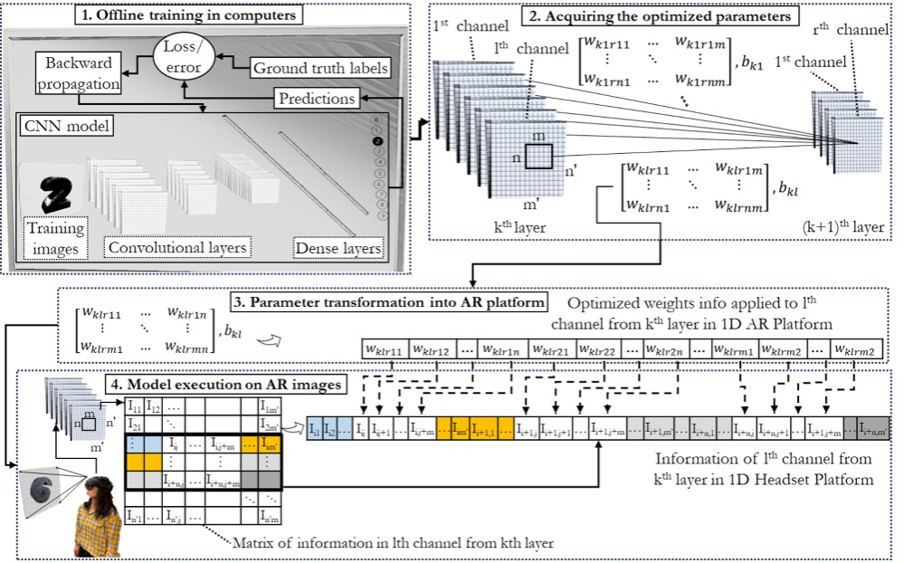
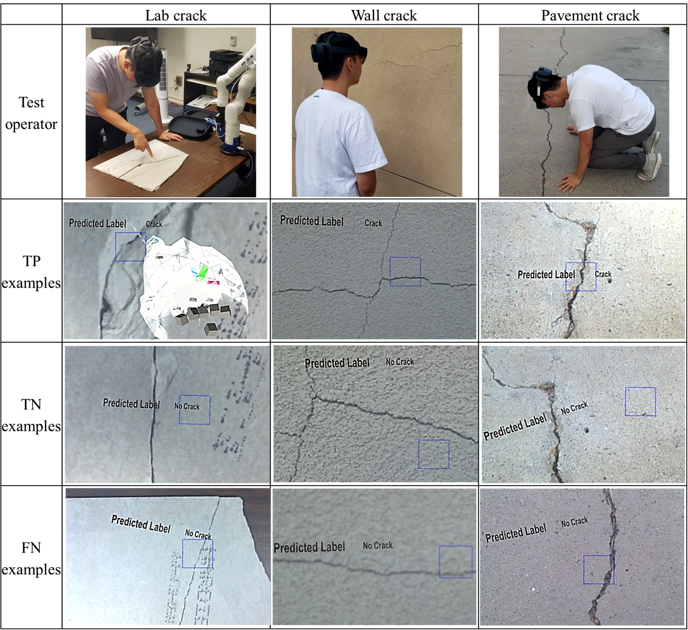
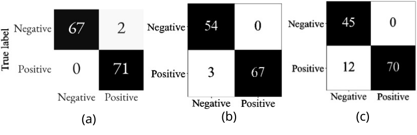

# On-Device CNN Inference for AR Headsets

This project implements a workflow for deploying trained CNN models directly on AR headsets for standalone inference. CNNs are trained in Python, their optimized weights and biases are converted to a C#/Unity-compatible 1D representation, and inference is executed on-device without external processing or network dependence.

## Methodology

The deployment workflow has four stages. First, a CNN is trained offline in Python using standard feedforward and backpropagation steps to optimize the model parameters. Second, the trained weights and biases are extracted from the best-performing model. Third, these parameters are converted into one-dimensional arrays so they can be used in the C#/UnityEngine environment of the AR headset. Fourth, images captured by the headset camera are converted to 1D arrays and passed through the pretrained CNN on-device, and the prediction is displayed to the user in the AR environment.

## Results

### Proof of concept

LeNet-5 was first deployed on Microsoft HoloLens 2 using MNIST as a proof of concept. The model achieved 99.1% test accuracy before deployment. On the headset, inference was triggered by the voice command `predict`, and the mean end-to-end time from image capture to displayed prediction was 883 ms over 10 tests.

### Crack classification

The same deployment workflow was then evaluated on real cracks captured with HoloLens 2 on concrete, walls, and asphalt surfaces. Examples of true positive, true negative, and false negative predictions are shown below.

On the computer test set, LeNet-5 achieved 99.05% accuracy, 99.45% precision, 98.68% recall, and 99.06% F1-score. On HoloLens 2, accuracy was 97.6% under stable capture conditions and 90.6% under more difficult lighting, motion, and viewing-distance conditions.

https://github.com/user-attachments/assets/51bfe0f3-da45-42eb-909b-c961141cc66c
